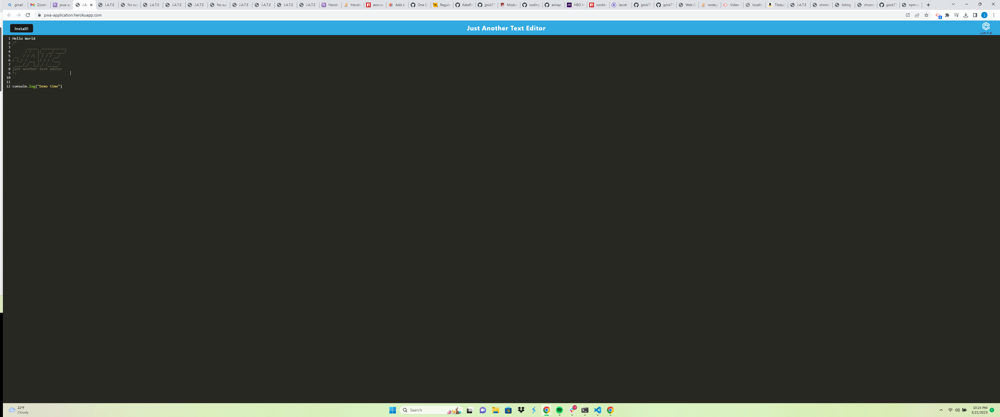
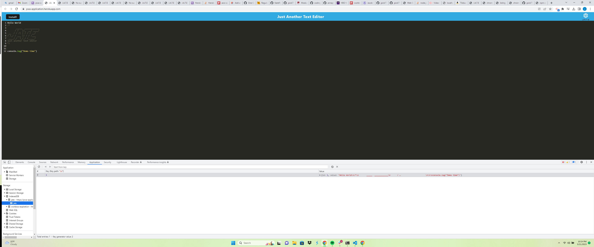
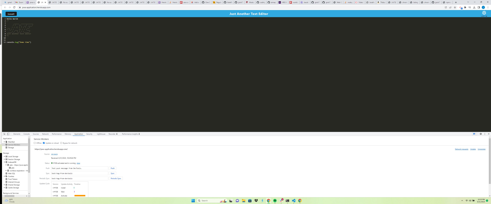

# PWA-Application 

  ## Description
  This application is a Progressive Web Application, this app runs as a text editor within the browser. A user can also install the app to the users desktop. It uses IndexdDB.

  ## Table of Contents

  - [installation](#installation)

  - [usage](#usage)

  - [license](#license)

  - [test](#test)

  - [contrabution](#contrabution)

  - [questions](#questions)

  ## Installation
  The user must install the following npm packages. Babel, Express, Nodemon, React, Webpack

  ## Usage
  In order to start the application the user must navigate into their terminal and use the following commands... npm install, npm run build, npm run start. 

  ## License
  MIT

  ## Test
  To test the app run node server.js.

  ## Contrabution
  Users can contrabute to the application on the issues page on my GitHub.

  ## Questions
  [jpick77](https://github.com/jpick77)

  jpickron30@gmail.com

  ## Screenshots
  
  
  
